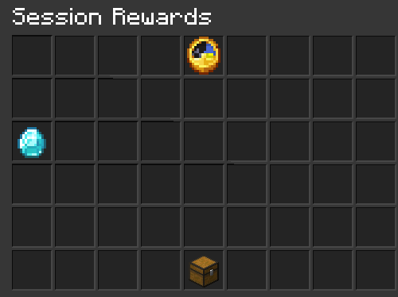
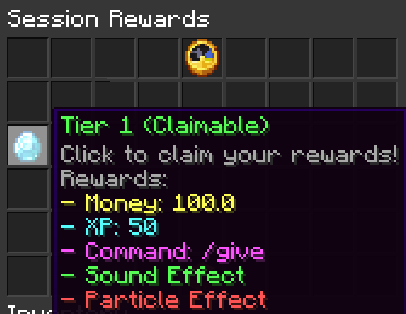

<h1 align="center">🧠 Momentum</h1>
<p align="center">
  ⏳ Reward your players for being online — the longer they stay, the more they gain.
</p>

<p align="center">
  
  
  
  
</p>

---

## ✨ Features

- 🎁 Unlock reward tiers based on **active playtime**
- ⌛ Session resets on logout or **continues on server switch**
- 💤 Session pauses when **AFK**
- 🧠 Fully configurable **rewards.yml** and **config.yml**
- 💸 Supports: Vault, XP, commands, Crates, particles, sounds
- 📦 GUI to view/claim unlocked rewards
- 🔀 Cross-server support via Redis
- 🧩 PlaceholderAPI integration
- 🆓 100% **Free & Open Source**

---

## 🖼️ GUI Preview

> 
> 
> 

---

## 🔧 Requirements

| Component      | Requirement                        |
|----------------|------------------------------------|
| Minecraft      | `1.21.x`                           |
| Server         | `Paper / Bukkit`                   |
| Economy        | Vault + (CMI, EssentialsX, etc.)   |
| Redis (config) | Optional, For cross-server support |
| PlaceholderAPI | Optional, for placeholders         |
| Java           | 21+                                |

---

## 📥 Installation

```bash
1. Download the latest release from GitHub or Modrinth
2. Drop it into `/plugins`
3. Install Vault and an economy plugin
4. (Optional) Set up Redis for multi-server sessions
5. Restart your server
