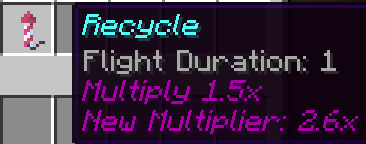

<h1 align="center">🚀 Momentum</h1>
<p align="center">
  ⏳ Reward your players for being online — the longer they stay, the more they gain. Now with Multipliers & Recycling!  
  <a href="https://github.com/thepixel3261/Momentum/wiki">📚 View Wiki</a> | 
  <a href="https://modrinth.com/plugin/momentum-rewards/">⬇️ Download</a>
</p>

<p align="center">
  
  
  
  
</p>

---

## ✨ Features

### Core Features
- 🎁 **Progressive Rewards** - Unlock better rewards the longer you play
- 🔄 **Recycling System** - Reset your progress for permanent multiplier boosts
- ⚡ **Multipliers** - Earn more with permission-based reward multipliers
- ⏳ **Session Persistence** - Progress continues across server switches (Redis enabled)
- 💤 **AFK Detection** - Pauses timers when players are AFK

### Technical Features
- 🌍 **Multi-Language** - Built-in support for multiple languages
- 🧩 **PlaceholderAPI** - Extensive placeholder support
- 🔗 **Cross-Server** - Redis support for network-wide sessions
- 🛠️ **Fully Configurable** - Customize every aspect of the plugin
- 💰 **Economy Support** - Works with Vault-compatible economy plugins
- 📊 **Statistics** - Track player progress and server metrics

### Reward Types
- 💵 Money rewards (Vault)
- ⭐ XP/Levels
- 🎯 Commands
- 🎇 Particles
- 🎵 Sounds
- And more through custom commands!

---

## 🖼️ GUI Preview

### Main Menu

*View your current playtime, available rewards, and multiplier status*

### Reward Tiers

*Earn better rewards as you play longer*

### Recycling System

*Reset your progress for permanent multiplier bonuses*

---

## ⚙️ Configuration

### Files
- `config.yml` - Main configuration file
- `rewards.yml` - Define reward tiers and rewards
- `languages/` - Customize plugin messages

### Commands
- `/momentum` - Open the rewards menu
- `/momentum reload` - Reload the configuration (requires `momentum.reload` permission)

### Permissions
```yaml
# Basic permissions
momentum.use: true  # Allows using /momentum
momentum.reload: op  # Allows reloading the config

# Multiplier permissions (grant these to players) (more possible, like 2_5)
momentum.multiplier.1_0: true  # 1x (default)
momentum.multiplier.2_0: false  # 2x multiplier
momentum.multiplier.3_0: false  # 3x multiplier
```

### Placeholders
```
%momentum_multiplier% - Current reward multiplier
%momentum_playtime% - Current session playtime
%momentum_next_tier% - Time until next reward tier
```

## 🔧 Requirements

| Component      | Requirement                        |
|----------------|------------------------------------|
| Minecraft      | `1.21.x`                           |
| Server         | `Paper / Bukkit`                   |
| Java           | `21+`                              |
| Vault          | Required for economy features      |
| Economy Plugin | EssentialsX, CMI, etc. (optional)  |
| Redis          | For cross-server support (optional)|
| PlaceholderAPI | For placeholders (optional)        |

---

## 📥 Installation

### Quick Start
1. Download the latest release from [GitHub](https://github.com/thepixel3261/Momentum/releases/latest) or [Modrinth](https://modrinth.com/plugin/momentum-rewards)
2. Place the JAR in your server's `/plugins` folder
3. Start your server to generate config files
4. Configure `rewards.yml` with your desired rewards
5. Restart the server

### Dependencies
- **Required**:
  - Java 21 or higher
  - Paper/Spigot 1.21.x
  - [Vault](https://www.spigotmc.org/resources/vault.34315/) (for economy support)
  - An economy plugin (EssentialsX, CMI, etc.)

- **Optional**:
  - [PlaceholderAPI](https://www.spigotmc.org/resources/placeholderapi.6245/) (for placeholders)
  - Redis (for cross-server functionality)

### Updating
1. Backup your configuration files
2. Replace the old JAR with the new one
3. Restart your server
